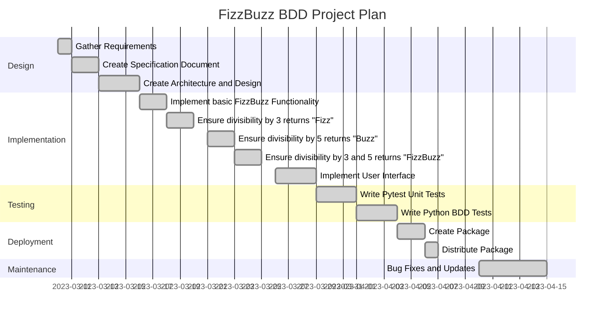

# Project Name: FuzzBuzz BDD

## Introduction
FizzBuzz BDD is a command-line program that simulates the FizzBuzz game. It allows users to play FizzBuzz by submitting a number and receiving the standard FizzBuzz response. It is primarily an experimmental repository to illustrate usage of pytest-bdd.

## Functional Requirements

### Developer

The library is packages with hatch. Developer usage is documented in `README.md`.

### User

#### Use Case: FizzBuzz

As a user, I want to be able to play FizzBuzz.

```gherkin
Feature: FizzBuzz game
  In order to practice TDD
  As a developer
  I want to implement the FizzBuzz game and test it using pytest-bdd

  Scenario: Playing FizzBuzz with a number not divisible by 3 or 5
    Given a number 7
    When I play FizzBuzz
    Then the result should be "7"

  Scenario: Playing FizzBuzz with a number divisible by 3
    Given a number 3
    When I play FizzBuzz
    Then the result should be "Fizz"

  Scenario: Playing FizzBuzz with a number divisible by 5
    Given a number 5
    When I play FizzBuzz
    Then the result should be "Buzz"

  Scenario: Playing FizzBuzz with a number divisible by both 3 and 5
    Given a number 15
    When I play FizzBuzz
    Then the result should be "FizzBuzz"
```


## Non-functional Requirements
FizzBuzz BDD should be easy to use and provide an accurate simulation of the standard FizzBuzz game within a reasonable amount of time. The program should be designed with security in mind and protect against common vulnerabilities such as buffer overflows and injection attacks.

## Architecture and Design
FizzBuzz BDD is designed as a python package with a command-line interface. It can be installed and executed from the command line. The interface accepts command line arguments and displays the result on execution.

## Data Model
FizzBuzz BDD uses simple data types such as integers and strings to represent numbers and words. 
The data model does not require any complex data structures or algorithms.

## External interfaces
FizzBuzz BDD does not interface with any external systems or APIs.

## Testing
FizzBuzz BDD will be tested using the [pytest](https://docs.pytest.org/en/stable/) framework with [pytest-bdd](https://pytest-bdd.readthedocs.io/en/stable/) to ensure that it meets the functional requirements outlined in this specification document.

## Deployment and Maintenance
FizzBuzz BDD will be distributed as a python package that can be installed and executed on any system with python version 3.8 or greater. The script will be maintained and updated using a version control system.

## Glossary
- FizzBuzz: A simple game where numbers are associated to the words "Fizz", "Buzz", or "FizzBuzz". Traditionally these associations are according to divisibility by the numbers 3, 5, or both respectively.

## Project plan

